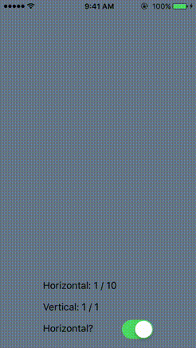

# react-native-paged-scroll-view

[](https://badge.fury.io/js/react-native-paged-scroll-view)

> A higher-order React Native component to compute the current and total pages of a ScrollView-compatible component

## Introduction

This module implements a [higher-order component](https://gist.github.com/sebmarkbage/ef0bf1f338a7182b6775) that computes the current and total pages contained in a React Native [ScrollView](https://facebook.github.io/react-native/docs/scrollview.html) (or functionally similar) component. So it's really very simple. Seriously, when you get down to it it's like a division and a floor function. But it attempts to solve layout race conditions, re-layout and other subtleties. This component could trivially be used as a swiper alongside a page indicator but does not implement that itself.

To be clear, this is strictly just a page-computing component. I assume you'll use it with [`pagingEnabled={true}`](https://facebook.github.io/react-native/docs/scrollview.html#pagingenabled), and it doesn't add paged scrolling for Android.

## Example



```javascript
import { ScrollView } from 'react-native'
import AddPaging from 'react-native-paged-scroll-view'
var PagedScrollView = AddPaging(ScrollView)

  ...
  handlePageChange (state) {
    console.log('current horizontal page:', state.currentHorizontalPage)
    console.log('current vertical page:  ', state.currentVerticalPage)
    console.log('total horizontal pages: ', state.totalHorizontalPages)
    console.log('total vertical pages:   ', state.totalVerticalPages)
  }

  render () {
    return (
      <PagedScrollView onPageChange={this.handlePageChange.bind(this)}>
        ...
      </PagedScrollView>
    )
  }
  ...
```

## Installation

```bash
$ npm install react-native-paged-scroll-view
```

## Usage

##### `require('react-native-paged-scroll-view')(Component, [scrollViewRefPropName="ref"])`
Wrap either a `ScrollView` or a component functionally equivalent (implements `onScroll` and similar basic methods). Returns a higher order component with props passed through.

**Arguments**:
- `Component`: The component being wrapped. It must implement the basic methods of a ScrollView.
- `scrollViewRefPropName`: the name of the property passed to `Component` that will return the ref. This exists in case you're using a wrapped a `ScrollView` component for which `ref` returns the ref of the wrapper instead of the ref of the `ScrollView`. If you provide this property, then your wrapped `ScrollView` should have a property `ref={this.props.<scrollViewRefPropName>} ` with your method name inserted. If you're just using a `ScrollView` though, you should be fine. Suggestions on how to improve this are welcome.

**Props**:
- `onPageChange`: `function(state)`: Executed on initial layout, when the page changes, or when the inner content changes. Callback is passed `state` object containing:
  - `totalHorizontalPages`: total number of horizontal pages, rounded to the nearest integer.
  - `totalVerticalPages`: total number of vertical pages, rounded to the nearest integer.
  - `currentHorizontalPage`: the current horizontal page, rounded to the nearest integer.
  - `currentVerticalPage`: the current vertical page, rounded to the nearest integer.
- `onInitialization`: `function(ref)`: Executed once, when the component is initially mounted and only once the dimensions have been measured. Useful, for example, for scrolling to a specific page once the component is mounted.

**Attributes**:
- `ref.scrollX`: current horizontal scroll offset
- `ref.scrollY`: current vertical scroll offset
- `ref.state.currentHorizontalPage`: as defined above
- `ref.state.currentVerticalPage`: as defined above
- `ref.state.totalHorizontalPages`: as defined above
- `ref.state.totalVerticalPages`: as defined above

**Methods**:
- `ref.scrollToPage(horizontal, vertical, animated)`: Scroll to a specific page

# License
(c) 2015 Ricky Reusser. MIT License.
